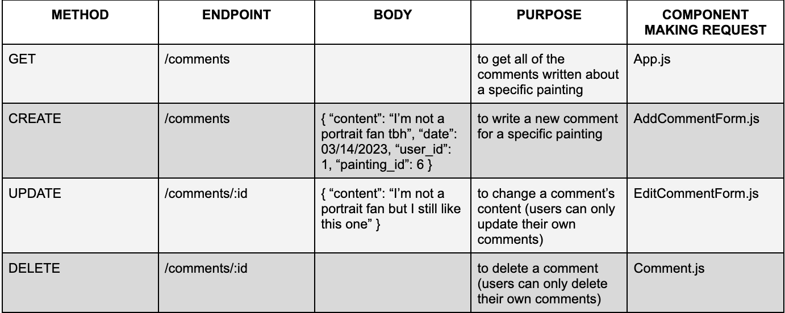

# ArtSmart

Welcome to ArtSmart!  ArtSmart is an app for art enthusiasts and those that just want ot learn more.  Here, users can browse all of the art in the database, which I hope to continue expanding.  Each user has a gallery where they can keep their favorite paintngs.  In addition, users can comment on any and all of the pieces and hopefully spark discussion with other users!

This app came into being as the capstone project in my software engineering bootcamp.  Personally, I am very interested in art, and I thought why not make an app for browsing, discoering new pieces, and meeting other enthusiasts.  The frontend is built with React.js and the backend with Ruby on Rails as an opportunity to showcase what I have learned in my course.

In the future, I would like to expand the available features on this app.  I have many ideas, including custom galleries that users can create, a follow feature to connect different users, and an entire page devoted to the artists themselves, among others.

## How to Install and Run
To run this app, make sure to run `bundle install` and `npm install --prefix client` (or just `npm install` if you navigated into the client directory).  This installs the dependences for the front and backend that the app needs to function.

To start the server, run `rails s`.  This will start the server on localhost:3000.  To run the frontend, first go to a new terminal, and run `npm start --prefix client` (or just `npm start` if you navigated into the client directory).  This will run the app on localhost:4000.

## Using ArtSmart

### Login/Signup
To make use of any of the features ArtSmart offers, you must first make an account.  This requires a name, a unique username, a unique and valid email and a password.  If any of the fields do not meet the requirements, error messages will appear and guide users.

### Homepage and MyGallery
Upon a succesful login or signup, users are redirected to the app's homepage.  Of all of the pieces in the database, five are randomly selected and displayed.  Users can view more by clicking the button at the bottom of the last paiting.  All functionality regarding the pieces of art are present on the homepage and the user's gallery.  Users can add or remove paintings from their gallery, view comments, add comments, and edit or delete their own comments (this function is not available if they are not the user who wrote the comment).

In the user's gallery, users can browse only the pieces that they have selected.  All functionality is still present here.

### Profile and Account Information
In the profile page, user's have the ability to view their account details (name, username, email), and change any of these details.  The requirements and validations still apply here, and error messages will appear and guide users if the input is invalid.

From this page, users can also delete their account.  They are directed to a page that confirms they want to delete their account, and if they choose to, they are redirected to the login page.

## Development Process
### Entity Relationship Diagram

- A user has many comments and many favorites
    - A user has many paintings through comments and also favorites
- An artist has many paintings
- A painting has many comments and many favorites
    - A painting has many users through comments and also favorites
    - A painting belongs to an artist
- A favorite belongs to a user and a painting
- A comment belongs to a user and a painting

### Model Validations

The user model has many validations to ensure the integrity of the entered data.
The other models validate that the most essential data is present.

### Routes

**User** is allowed full CRUD capabilities.  Users can create accounts, edit personal information, delete their account, and of course have access to the data associated with their account.

**Painting** is only given read capabilities.  All paintings are fetched when a user logs in and then displayed according to the specific criteria.

**Comment** is also allowed full CRUD capabilities.  Users may view the comments for a specific painting, write and post comments, and edit and delete comments (if they belong to that user).

**Favorites** is given read, post, and delete capabilities.  All favorites are fetched upon login, and then users can add a painting to their gallery (create a new favorite) or remove a painting from their gallery (delete a favorite).

## Frontend

Component Tree:

- `App.js`
    - Container element
- `Login.js`
    - Users are directed to this page when they reach the app
- `Signup.js`
    - If users don't have an account, they create one here
- `Header.js`
    - Visible on all pages except Login.js and Signup.js.  Has links to all of app's pages.
- `Homepage.js`
    - Users are directed here after successful login/signup.  Displays five random pieces of art with button to continuously display five more until all are shown.
- `MyGallery.js`
    - Displays all of the pieces of art that a users has added to their gallery.
- `Search.js`
    - Filters art being displayed based on what the user types (only filters by name of art or artist)
- `ArtList.js`
    - Holds all of the cards for each piece of art being displayed
- `ArtCard.js`
    - Renders a card for each piece of art
- `Comment.js`
    - Show one comment with related functionality if available (users can only interact with a comment if it is theirs)
- `AddCommentForm.js`
    - Allows users to comment on a specific piece of art
- `EditCommentForm.js`
    - Allows users to edit their own comments
- `Profile.js`
    - Displays account information
- `DeleteAccount.js`
    - Asks user if they are sure they want to delete their account.  If yes, the account is deleted and the user is directed to the login page.  If no, then they are directed back to the homepage.
- `EditAccountForm.js`
    - Allows users to change their account information