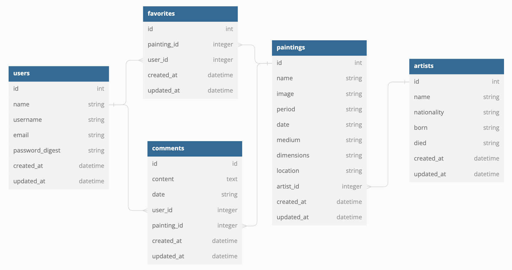
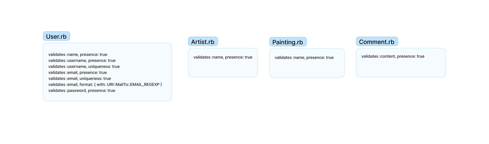
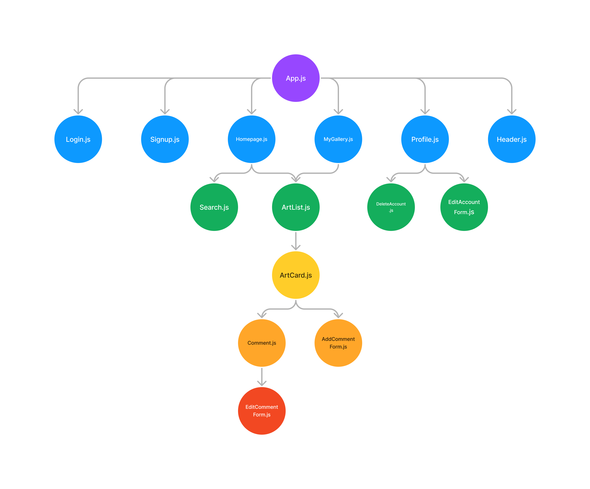

# ArtSmart

Welcome to ArtSmart!  ArtSmart is an app that allows users to browse art, save it to their favorites, and have discussions with others users by commenting on different pieces. The art available on the website comes from [The Metropolitan Museum of Art](https://github.com/metmuseum/) API which has data for their entire collection.

## Backend

ArtSmart utilizes Ruby on Rails to develop the backend.  There are four tables `User.rb`, `Artist.rb`, `Painting.rb`, and `Comment.rb`.

### Entity Relationship Diagram

A user have many paintings and have many artists through paintings.  An artist has many paintings and many users through paintings.  A painting belongs to a user and an artist.  Finally, a painting has many comments, and each comment belongs to a painting.

### Model Validations

The user model has many validations to ensure the integrity of the entered data.  Regex is used to make sure email and password inputs meet the various requirements.
The other models validate that the most essential data is present.

### Routes

**User** is allowed full CRUD capabilities.  Users can create accounts, edit personal information, delete their account, and of course have access to the data associated with their account.

**Painting** is allowed update and read capabilities.  Painting data is fetched and displayed depending on the specific criteria.  Also, a user favorite a painting and change the `user_favorite` attribute.

**Comment** is also allowed full CRUD capabilities.  Users may view the comments for a specific painting, write and post comments, and edit and delete comments (if they belong to that user).

## Frontend

ArtSmart utilized React to develop the frontend.  There are a total of twelve components:
- App.js
- Login.js
- Signup.js
- Homepage.js
- MyGallery.js
- BucketList.js
- SeenArt.js
- Profile.js
- Search.js
- ArtList.js
- ArtCard.js
- DeleteAccount.js
- Header.js

Component Tree:

### `App.js`
**App** is the container component.  It holds all the children.

### `Login.js`
**Login** is the component that users are directed to when they go to the app.  They can either login and be directed to `Homepage.js` or they can click a button to be directed to `Signup.js`.

### `Signup.js`
**Signup** is the component where users can create an account with ArtSmart.  Upon successful creation, users are directed to `Homepage.js`.  `Signup.js` is making a POST request to `/users`.

### `Homepage.js`
**Homepage** is the component that users are directed to as soon as they login/signup.  It shows `Header.js` at the top and `ArtCard.js` of a randomly generated painting.

### `MyGallery.js`
**MyGallery** is the component that contains an `ArtCard.js` for every painting the user has added to their gallery.

### `BucketList.js`
**BucketList** is the component that contains an `ArtCard.js` for every painting the user has added to their bucket list.

### `SeenArt.js`
**SeenArt** is the component that contains an `ArtCard.js` for every painting the user has marked as "seen".

### `ArtList.js`
**ArtList** is the component that renders and holds an `ArtCard.js` for every piece of art that meets the given criteria.

### `ArtCard.js`
**ArtCard** is the that renders the details for every piece of art.

### `Search.js`
**Search** is visible on `Homepage.js` and allows users to filter for art based on the title of the piece, the artist, or the medium.  It renders `ArtList.js` with the appropriate responses.

### `Profile.js`
**Profile** is the component where users than view and update their personal information.  It also contains a button that directs users to `DeleteAccount.js` is they want to delete their account.

### `DeleteAccount.js`
**DeleteAccount** is the component where users confirm that they would like to delete their account.  Upon confirmation, users are redirected to `Signup.js`.

### `Header.js`
**Header** is the component where the navigation bar lives.  The navigation bar contains routes that allows users to navigate throughout the app.  It is visible on every component except `Login.js` and `Signup.js` because users have to be logged in to access the rest of the app's functionality.